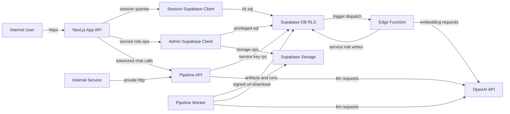

# OpenAIP Threat Model

## Executive summary
OpenAIP's top risks cluster around privileged boundary handling: service-role Supabase access in server handlers, static shared token trust between website and pipeline chat APIs, and ingesting untrusted uploaded PDFs into parser/LLM workflows. Under the selected context (web public, pipeline intended private, latest March hardening assumed, published data mostly public), the highest-priority abuse paths are unauthorized pipeline run control if network isolation drifts, internal token compromise, service-role misuse, and ingest-driven availability/cost attacks.

## Scope and assumptions
- In-scope paths:
  - `website/app/api`, `website/lib`
  - `aip-intelligence-pipeline/src/openaip_pipeline`
  - `supabase/functions/embed_categorize_artifact/index.ts`
  - `website/docs/sql`
- Out-of-scope:
  - `node_modules`, `.venv`, `.next`, local caches/build artifacts
  - test/mocks-only behavior
  - UI styling and non-security UX concerns
- Assumptions used for ranking:
  - Website is internet-facing.
  - Pipeline should be private/internal and only reached by trusted backend services.
  - March 2026 hardening SQL is applied (`2026-03-01_*` files).
  - Published AIP data is mostly public; draft/workflow and secrets are sensitive.
  - Multi-tenant risk is weighted more heavily for draft/scope-restricted operations than for published corpus reads.
- Open questions that materially affect ranking:
  - Is ingress to pipeline `/v1/runs/*` technically blocked from public internet in all environments?
  - Is there a deployment gate that fails releases when required security migrations are missing?
  - Are pipeline/service tokens rotated and replay-protected, or still long-lived shared secrets?

## System model
### Primary components
- Internet clients using Next.js routes and route handlers (`website/app/api/**`).
- Next.js server using user-context Supabase client (`website/lib/supabase/server.ts`).
- Next.js server using service-role Supabase client (`website/lib/supabase/admin.ts`).
- Pipeline API (`aip-intelligence-pipeline/src/openaip_pipeline/api`) for runs/chat.
- Pipeline worker (`aip-intelligence-pipeline/src/openaip_pipeline/worker`) for extraction stages.
- Supabase Postgres/RLS/Storage/DB functions and triggers (`website/docs/sql/database-v2.sql`).
- Supabase Edge Function `embed_categorize_artifact` (`supabase/functions/embed_categorize_artifact/index.ts`).
- OpenAI APIs used by extraction/validation/summarization/categorization/embeddings.

### Data flows and trust boundaries
- Internet -> Next.js API/route handlers:
  - Data: auth credentials, chat prompts, uploaded PDFs, query params.
  - Channel: HTTPS.
  - Security guarantees: role and session checks (`getActorContext`, middleware session checks), route-level validation.
  - Validation: field/type checks, PDF extension/MIME checks, max upload size.
- Next.js (session client) -> Supabase (RLS path):
  - Data: user-scoped reads/writes for feedback, sessions, dashboard, profile.
  - Channel: HTTPS to Supabase.
  - Security guarantees: Supabase auth + RLS policies (`can_read_aip`, chat session policies).
  - Validation: DB constraints/policies plus handler-level prechecks.
- Next.js (service-role client) -> Supabase (privileged path):
  - Data: admin writes, storage uploads/removals, quota RPC calls.
  - Channel: HTTPS to Supabase.
  - Security guarantees: only server-side env key usage (`SUPABASE_SERVICE_ROLE_KEY`) and route auth checks.
  - Validation: application-side actor checks; RLS bypass risk if handler checks fail.
- Next.js -> Pipeline chat API:
  - Data: question text, scope payload, embedding requests.
  - Channel: HTTPS with `x-pipeline-token`.
  - Security guarantees: static shared token in pipeline chat routes.
  - Validation: pydantic request models and token equality check.
- Pipeline worker/API -> Supabase DB/Storage:
  - Data: extraction run state, artifacts, chunks/embeddings, signed URL fetches.
  - Channel: HTTPS REST/storage APIs.
  - Security guarantees: service key access and DB constraints.
  - Validation: stage logic, parse checks, limited error sanitization.
- Pipeline/Edge Function -> OpenAI:
  - Data: extracted document/page content, query text, chunk text for embeddings.
  - Channel: HTTPS to OpenAI API.
  - Security guarantees: API key-based auth.
  - Validation: app-side response-shape checks.
- Supabase DB trigger/RPC -> Edge Function:
  - Data: AIP publish event payload and job secret header.
  - Channel: `pg_net` HTTP POST from DB function.
  - Security guarantees: `dispatch_embed_categorize_for_aip` execution limited to `service_role`; edge checks `x-job-secret`.
  - Validation: DB function guards for missing URL/secret; edge request method/secret checks.

#### Diagram

## Assets and security objectives
| Asset | Why it matters | Security objective (C/I/A) |
|---|---|---|
| Supabase service-role credentials (`SUPABASE_SERVICE_ROLE_KEY`, `SUPABASE_SERVICE_KEY`) | Bypass normal RLS boundaries and enable broad DB/storage access | C, I |
| Pipeline internal shared token (`PIPELINE_INTERNAL_TOKEN`) | Authorizes pipeline chat endpoints used for retrieval/embedding | C, I |
| Draft AIP and workflow state (`aips`, `uploaded_files`, `extraction_runs`) | Contains not-yet-public government planning data and review state | C, I |
| Published chunk/embedding/index data (`aip_chunks`, `aip_chunk_embeddings`) | Drives chatbot grounding and public trust in answers | I, A |
| Pipeline compute capacity and OpenAI budget | Core extraction/chat availability and operating cost control | A |
| Audit and rate-control records (`activity_log`, `chat_rate_events`) | Needed for incident reconstruction and abuse containment | I, A |

## Attacker model
### Capabilities
- Remote unauthenticated user can call public routes and probe behavior.
- Authenticated low-privilege users can send high-volume chat requests and crafted inputs.
- Compromised LGU official account can upload PDFs and trigger extraction workflows.
- Attacker with leaked app/server secrets can call privileged internal APIs or DB paths.
- Opportunistic attacker can exploit deployment drift (missing migrations, exposed internal ports).

### Non-capabilities
- Cannot directly read service-role env vars without server/ops compromise.
- Cannot execute `dispatch_embed_categorize_for_aip` as anon/authenticated role when SQL grants are correctly applied.
- Cannot insert non-user `chat_messages.role` through normal authenticated client path due to RLS insert policy.
- Cannot access draft AIP rows through public RLS reads when policies are current and correctly deployed.

## Entry points and attack surfaces
| Surface | How reached | Trust boundary | Notes | Evidence (repo path / symbol) |
|---|---|---|---|---|
| `POST /auth/sign-in`, `POST /auth/staff-sign-in` | Public website auth forms | Internet -> Next.js | Password auth, lockout enforcement, session cookie policy | `website/app/auth/sign-in/route.ts`, `website/app/auth/staff-sign-in/route.ts`, `website/lib/security/login-attempts.server.ts` |
| `POST /auth/sign-up`, `POST /auth/verify-otp` | Public website auth forms | Internet -> Next.js | Citizen onboarding and OTP verification | `website/app/auth/sign-up/route.ts`, `website/app/auth/verify-otp/route.ts` |
| `POST /api/barangay/aips/upload` | Authenticated barangay official | Internet -> Next.js -> Supabase admin/storage | PDF upload, run queue insert | `website/app/api/barangay/aips/upload/route.ts` |
| `POST /api/city/aips/upload` | Authenticated city official | Internet -> Next.js -> Supabase admin/storage | PDF upload, run queue insert | `website/app/api/city/aips/upload/route.ts` |
| `GET/POST /api/*/aips/runs/[runId]*` | Authenticated LGU flows | Internet -> Next.js -> Supabase | Run status and retry operations | `website/app/api/barangay/aips/runs/[runId]/route.ts`, `.../retry/route.ts`, city equivalents |
| `POST /api/barangay/chat/messages` | Authenticated barangay/city official | Internet -> Next.js -> Supabase + Pipeline | High-complexity route with SQL + pipeline fallback logic | `website/app/api/barangay/chat/messages/route.ts` |
| `POST /api/citizen/chat/reply` | Authenticated citizen | Internet -> Next.js -> Supabase + Pipeline | Citizen chatbot with quota + blocked-user checks | `website/app/api/citizen/chat/reply/route.ts` |
| `GET /api/projects/cover/[projectId]` | Public project media URL | Internet -> Next.js -> Supabase admin/storage | Published-only cover fetch path | `website/app/api/projects/cover/[projectId]/route.ts` |
| `GET /api/projects/media/[mediaId]` | Public/role-gated project update media | Internet -> Next.js -> Supabase admin/storage | Hidden-media access checks for scoped officials/admin | `website/app/api/projects/media/[mediaId]/route.ts` |
| `GET /api/citizen/about-us/reference/[docId]` | Public document redirect | Internet -> Next.js -> Supabase admin/storage | Signed URL generation or HTTPS external redirect | `website/app/api/citizen/about-us/reference/[docId]/route.ts` |
| `GET /api/system/security-policy` | Public API call | Internet -> Next.js | Returns computed lockout/session policy settings | `website/app/api/system/security-policy/route.ts`, `website/lib/security/security-settings.server.ts` |
| `POST /v1/chat/answer`, `POST /v1/chat/embed-query` | Website server-to-pipeline call | Next.js -> Pipeline | Auth via `x-pipeline-token` | `aip-intelligence-pipeline/src/openaip_pipeline/api/routes/chat.py`, `website/lib/chat/pipeline-client.ts` |
| `POST /v1/runs/enqueue`, `GET /v1/runs/{run_id}`, `POST /v1/runs/dev/local` | Pipeline API listener | Network -> Pipeline | No internal-token enforcement on `/v1/runs/*` | `aip-intelligence-pipeline/src/openaip_pipeline/api/routes/runs.py` |
| `POST /functions/v1/embed_categorize_artifact` | Triggered by DB or direct caller | Supabase DB/Network -> Edge Function | Header secret check, then chunk/embed writes | `supabase/functions/embed_categorize_artifact/index.ts` |

## Top abuse paths
1. `AP-01` Malicious PDF ingestion: compromised official uploads crafted PDF -> worker downloads signed file and parses pages -> extraction/validation prompts process adversarial content -> repeated failures/token burn degrade availability and raise cost.
2. `AP-02` Pipeline runs abuse on exposure drift: pipeline host becomes reachable from internet -> attacker calls `/v1/runs/enqueue` or `/v1/runs/{run_id}` without token -> unauthorized run churn and status probing impact pipeline integrity/cost.
3. `AP-03` Shared token compromise: attacker obtains `PIPELINE_INTERNAL_TOKEN` from server/log/ops leak -> calls `/v1/chat/answer` and `/v1/chat/embed-query` directly -> unauthorized usage and data scraping of published retrieval corpus.
4. `AP-04` Service-role misuse in web server: bug or compromise reaches handlers using `supabaseAdmin()` -> attacker drives privileged DB/storage actions that bypass normal RLS scope checks -> broad confidentiality/integrity impact.
5. `AP-05` Edge invocation abuse: job secret leaks or edge ingress lacks stronger anti-replay controls -> attacker posts fake indexing jobs -> chunk/embedding pollution and unnecessary OpenAI spending.
6. `AP-06` Migration drift regression: environment misses March hardening SQL while app assumes it is present -> uploader lock and quota controls weaken -> unauthorized workflow edits or abuse scale-up.
7. `AP-07` Policy reconnaissance: attacker queries public security-policy endpoint -> learns lockout/session timing details -> optimizes credential-stuffing and low-noise brute-force campaigns.

## Threat model table
| Threat ID | Threat source | Prerequisites | Threat action | Impact | Impacted assets | Existing controls (evidence) | Gaps | Recommended mitigations | Detection ideas | Likelihood | Impact severity | Priority |
|---|---|---|---|---|---|---|---|---|---|---|---|---|
| TM-001 | Malicious/compromised LGU official | Valid official account with upload rights | Upload crafted PDFs that stress parser/LLM stages and queue repeated runs | Pipeline slowdown, failed runs, higher OpenAI spend, possible extraction integrity degradation | Pipeline compute budget, run integrity, draft workflow availability | Upload gate + scope checks and PDF size/type checks (`website/app/api/*/aips/upload/route.ts`); error sanitization in worker (`worker/processor.py`) | No magic-byte validation, no malware/CDR step, limited ingestion abuse throttling | Enforce MIME+magic validation, optional malware scan/CDR, per-user queue caps, worker resource quotas, non-root containers | Alert on per-user failed-run spikes and token/spend anomalies; monitor extraction exception rates by uploader | Medium | High | high |
| TM-002 | Remote attacker exploiting network drift | Pipeline API becomes publicly reachable | Call `/v1/runs/enqueue` and run status routes without token auth | Unauthorized run creation/status probing, compute/cost abuse, processing noise | Extraction run integrity, compute budget, operational availability | Intended private deployment pattern (docs); `dev/local` route guarded by env flag (`runs.py`) | `/v1/runs/*` lacks internal token/mTLS auth; relies on network isolation alone | Add explicit authn/authz for `/v1/runs/*` (token/mTLS/IAP), ingress allow-lists, WAF/rate-limits, disable unused routes by default | Detect non-website source IPs and abnormal enqueue rates; alert on run creation without expected caller identity | Medium (High if exposed) | High | high |
| TM-003 | Attacker with leaked internal token | Token disclosure via server compromise/logging/ops error | Invoke pipeline chat and embedding endpoints directly with `x-pipeline-token` | Unauthorized model usage, retrieval scraping, cost escalation | Pipeline internal token, compute budget, published retrieval service quality | Token equality check in pipeline (`chat.py::_require_internal_token`); server-only env usage in website bridge (`pipeline-client.ts`) | Static long-lived shared secret, no replay protection or caller binding | Replace static token with short-lived signed service token (JWT/HMAC + timestamp + audience + nonce), rotate secrets, enforce clock window | Alert on token use from unknown origins, replay-like request bursts, and off-hours invocation patterns | Medium | High | high |
| TM-004 | App-layer bug or server compromise | Reachability into handlers that instantiate service-role client | Abuse privileged `supabaseAdmin()` calls to bypass RLS and perform broad DB/storage operations | Confidentiality/integrity compromise across sensitive operational data | Service-role credentials, draft/workflow state, audit trust | Route-level actor checks in admin/LGU handlers; DB RLS for non-service flows (`website/app/api/**`, `database-v2.sql`) | Service-role key has broad blast radius; no centralized policy wrapper for privileged actions | Split service-role privileges by subsystem, wrap privileged operations with invariant checks, reduce direct admin client usage, add structured access audit logs | Log and alert on high-risk service-role operations (storage delete, mass updates, settings writes), with actor correlation | Medium | High | high |
| TM-005 | External actor with leaked edge secret or weak ingress controls | Knowledge of edge endpoint and valid/accepted secret | Submit forged embed jobs to create noisy or misleading chunk/embedding updates | Retrieval integrity degradation and avoidable embedding spend | Published retrieval index integrity, OpenAI budget | Edge checks request method and `x-job-secret` (`embed_categorize_artifact/index.ts`); dispatch RPC grant limited to `service_role` (`database-v2.sql`) | Header secret alone; no nonce/timestamp anti-replay, no caller attestation | Add JWT/HMAC signed body with nonce/timestamp, rotate secret, restrict ingress by source network/service identity | Alert on edge invocations lacking expected dispatch telemetry linkage (`request_id`, AIP state), monitor embed-run anomaly rates | Medium | High | high |
| TM-006 | Deployment/configuration drift | Incomplete SQL migration application in target env | Hardening functions/policies not present while app assumes they are | Authorization regressions and quota/abuse control weakening | Workflow integrity, rate-control effectiveness | March patches exist (`website/docs/sql/2026-03-01_*`); base schema controls in `database-v2.sql` | Root migration guidance can drift from current patch set; no enforced migration-state gate | Add CI/startup migration assertion for required security SQL files and function signatures; block deploy on drift | Emit startup/health warning on missing functions/policies; periodic migration compliance checks | Medium | High | high |
| TM-007 | Remote recon attacker | Public access to policy route | Query detailed session/lockout policy and tune credential attacks accordingly | Improved attack efficiency against auth endpoints | Auth/session resilience, account safety | Login attempt lockout and session policy enforcement (`sign-in` routes, `login-attempts.server.ts`) | `GET /api/system/security-policy` exposes detailed policy values publicly | Restrict/redact policy endpoint output for public callers; provide coarse status only | Monitor enumeration of policy endpoint + correlated auth failures; alert on tuned lockout-threshold probing | High | Medium | medium |

## Criticality calibration
- `critical` for this repo:
  - Definition: pre-auth compromise or secret-path abuse that can directly cause broad privileged data mutation/exfiltration or long-lived service outage across core workflows.
  - Examples:
    - Publicly reachable and unauthenticated `/v1/runs/*` exploited at scale with no ingress controls.
    - Service-role key compromise enabling unrestricted draft/workflow and storage access.
- `high` for this repo:
  - Definition: realistic attacks with strong confidentiality/integrity/availability impact that require token/role compromise or deployment drift.
  - Examples:
    - `TM-001` malicious official PDF ingestion causing sustained extraction failures/cost spikes.
    - `TM-003` `PIPELINE_INTERNAL_TOKEN` compromise enabling unauthorized model calls.
    - `TM-004` misuse of `supabaseAdmin()` paths to bypass normal RLS trust boundaries.
- `medium` for this repo:
  - Definition: attacks with meaningful but bounded impact, or strong dependency on assumptions (exposure/config state).
  - Examples:
    - `TM-007` policy-recon endpoint enabling better brute-force tuning but not direct auth bypass.
    - Early-stage migration drift that weakens controls but has not yet been weaponized.
- `low` for this repo:
  - Definition: low-sensitivity leakage or noisy abuse with limited operational/user impact and straightforward mitigation.
  - Examples:
    - Non-sensitive route metadata discovery without privilege escalation.
    - Minor malformed-input errors that do not alter data or bypass controls.

## Focus paths for security review
| Path | Why it matters | Related Threat IDs |
|---|---|---|
| `website/lib/supabase/admin.ts` | Central privileged Supabase client using service-role key | TM-004 |
| `website/lib/chat/pipeline-client.ts` | Shared token bridge to pipeline chat endpoints | TM-003 |
| `website/lib/supabase/proxy.ts` | Session/role gate and route-level auth behavior | TM-004, TM-007 |
| `website/app/auth/sign-in/route.ts` | Citizen login flow and lockout interaction | TM-007 |
| `website/app/auth/staff-sign-in/route.ts` | Staff role validation and lockout behavior | TM-007 |
| `website/lib/security/login-attempts.server.ts` | Lockout state machine and persistence | TM-007 |
| `website/app/api/barangay/aips/upload/route.ts` | PDF upload validation, queueing, storage write | TM-001 |
| `website/app/api/city/aips/upload/route.ts` | City upload path symmetry and gating | TM-001 |
| `website/app/api/barangay/chat/messages/route.ts` | High-complexity chat orchestration, quota RPC, SQL + pipeline fallback | TM-003, TM-004 |
| `website/app/api/citizen/chat/reply/route.ts` | Citizen chatbot rate controls and pipeline bridge | TM-003 |
| `website/app/api/system/security-policy/route.ts` | Public policy exposure surface | TM-007 |
| `website/lib/security/security-settings.server.ts` | Serialized security policy data returned to API consumers | TM-007 |
| `aip-intelligence-pipeline/src/openaip_pipeline/api/routes/runs.py` | `/v1/runs/*` exposure and lack of internal-token checks | TM-002 |
| `aip-intelligence-pipeline/src/openaip_pipeline/api/routes/chat.py` | Internal token enforcement for chat APIs | TM-003 |
| `aip-intelligence-pipeline/src/openaip_pipeline/worker/processor.py` | Signed URL fetch, stage execution, failure handling, embedding writes | TM-001 |
| `aip-intelligence-pipeline/src/openaip_pipeline/adapters/supabase/client.py` | Service-key REST/storage operations and signed URL creation | TM-001, TM-004 |
| `aip-intelligence-pipeline/src/openaip_pipeline/services/extraction/barangay.py` | PDF page extraction and model call path for barangay scope | TM-001 |
| `aip-intelligence-pipeline/src/openaip_pipeline/services/extraction/city.py` | PDF page extraction and model call path for city scope | TM-001 |
| `supabase/functions/embed_categorize_artifact/index.ts` | Edge secret check, chunk plan, embedding writes | TM-005 |
| `website/docs/sql/database-v2.sql` | Core RLS/functions/grants/triggers for access and retrieval | TM-004, TM-005, TM-006 |
| `website/docs/sql/2026-03-01_barangay_aip_uploader_workflow_lock.sql` | Hardening of uploader workflow authorization | TM-006 |
| `website/docs/sql/2026-03-01_admin_usage_controls_chat_quota_and_policy_cleanup.sql` | Chat quota function/grants hardening | TM-006 |
| `README.md` | Migration ordering guidance used during deployment | TM-006 |

## Quality check
- Entry points covered: yes; all security-relevant external surfaces discovered in code are represented in the attack-surface table.
- Trust boundaries covered in threats: yes; each listed boundary maps to at least one `TM-*` item.
- Runtime vs CI/dev separation: yes; dev-only route (`/v1/runs/dev/local`) and mock/dev bypass flags are explicitly called out as conditional risk factors.
- Existing controls vs gaps for high-priority threats: yes; each high/critical-relevant threat row includes evidence-backed controls, concrete gaps, and mitigations.
- Context assumptions reflected: yes; rankings explicitly use web-public + pipeline-private intent + latest March migrations + published-data-mostly-public stance.
- ID consistency: yes; abuse paths (`AP-01`..`AP-07`) and threat IDs (`TM-001`..`TM-007`) are stable and aligned.

